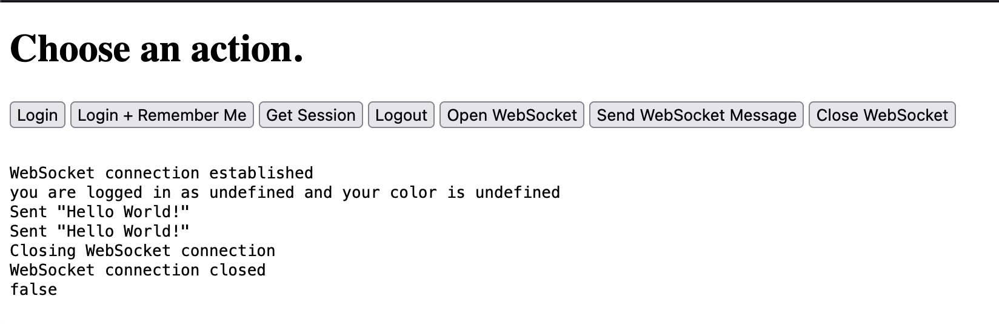

# Websocket session test

## How to run

1. Run the following command

        node index.js

### Commands

1. Do a login

        curl -s -b node_modules/delete-this.tmp -c node_modules/delete-this.tmp  -X POST "http://localhost:3000/auth/login"   -H "Content-Type: application/json"   -d '{"email": "abc@example.com", "password": "123456789"}'   --retry 0   --connect-timeout 30

1. Retrieve a session

        curl -s -b node_modules/delete-this.tmp -c node_modules/delete-this.tmp -X GET "http://localhost:3000/auth/session"   --retry 0   --connect-timeout 30 

### How does this app work?

1. When you run the app
1. Go to [http://localhost:3000](http://localhost:3000) and click on _**Get Session**_. It should return false if there is no session

### What is expected to happen?

1. You click _**Login + Remember Me**_
1. It logs you in and assigns a _**rememberMe**_ cookie
1. You close the browser
1. Open the browser again and navigate to [http://localhost:3000](http://localhost:3000)
1. You click _**Get Session**_ and it should return the logged in user

### What is happening?

1. You click _**Login + Remember Me**_
1. It throws the error below in the backend

        TypeError: Cannot set properties of undefined (setting 'user')
        at /Users/vr/cookie-session-ws-test/node_modules/passport-remember-me/node_modules/passport/lib/passport/http/request.js:45:35
        at pass (/Users/vr/cookie-session-ws-test/node_modules/passport/lib/authenticator.js:292:43)
        at serialized (/Users/vr/cookie-session-ws-test/node_modules/passport/lib/authenticator.js:301:7)
        at file:///Users/vr/cookie-session-ws-test/index.js:36:3
        at pass (/Users/vr/cookie-session-ws-test/node_modules/passport/lib/authenticator.js:309:9)
        at Authenticator.serializeUser (/Users/vr/cookie-session-ws-test/node_modules/passport/lib/authenticator.js:314:5)
        at req.login.req.logIn (/Users/vr/cookie-session-ws-test/node_modules/passport-remember-me/node_modules/passport/lib/passport/http/request.js:43:29)
        at file:///Users/vr/cookie-session-ws-test/index.js:160:9
        at strategy.success (/Users/vr/cookie-session-ws-test/node_modules/passport/lib/middleware/authenticate.js:222:18)
        at verified (/Users/vr/cookie-session-ws-test/node_modules/passport-local/lib/strategy.js:83:10)
